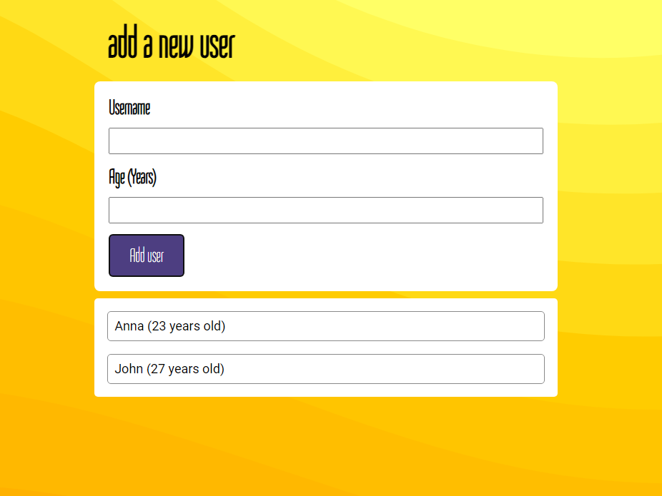

# Add User React micro-project
> This is the first time I used React on my own. Yay! 🎉
> Live demo [_here_](https://abarnowska.github.io/addUser/).

## General Information
- I am in the middle of a React course, and this project was to help me use my new skills for the first time in action. My project allows adding new users and their ages to the dynamic list.

## Technologies Used
- React

## Screenshots

## Acknowledgements
- I got the idea for this project from Maximilian Schwarzmüller [_Academind_](https://academind.com/).

## Contact
Created by Angelika Barnowska-Nawara. Feel free to contact me! (angelika.barnowska@gmail.com)